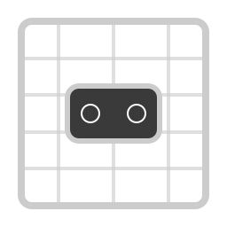

<div align="center">
  
  <h1>xr-chaperone</h1>
  <p>I accidentally punched a wall, then walked into a desk, so made this.</p>
</div>

---

xr-chaperone is a Steam Room Setup inspired chaperone system for OpenXR, once configured it'll render a grid around
your playspace and light up when you get too close.

> Early warning, while this should work on any overlay-capable OpenXR compositor, it's only been tested on Monado.
> In addition, it's only been tested with the Valve Index, it should work with other headsets, but I have no idea how
> well. Your mileage may vary. It also WILL have bugs, those happen, please report them :D

----

### Installation

Currently there are no releases, but you can grab a prebuilt AppImage of the latest code from
[here](https://nightly.link/frostycoolslug/xr-chaperone/workflows/release.yml/main/xr-chaperone-x86_64.zip).

#### Build from Source

Simple, checkout code, have rust and run:

```bash
cargo run --release
```

----

### Usage

Mostly, make sure your VR setup is running, run the app, then follow the on-screen instructions. Setup happens on your
monitor, so you just need a controller.

**Service Mode** - If you want to run headlessly without a GUI, once you've set up your chaperone you can launch
this app with the `-s` parameter which will stop it from spawning a window.

----

### Settings

Mostly self-explanatory, but here they are:

| Setting      | Description                                     | Default |
|--------------|-------------------------------------------------|---------|
| Fade start   | Distance (m) at which the grid starts appearing | 0.75m   |
| Fade end     | Distance (m) at which the grid is fully opaque  | 0.0m    |
| Wall height  | How tall the grid walls are                     | 2.5m    |
| Grid spacing | Size of each grid square                        | 0.4m    |
| Line width   | Thickness of grid lines                         | 0.01m   |
| Grid colour  | Colour of the grid (with alpha)                 | Blue    |

----

That is all.